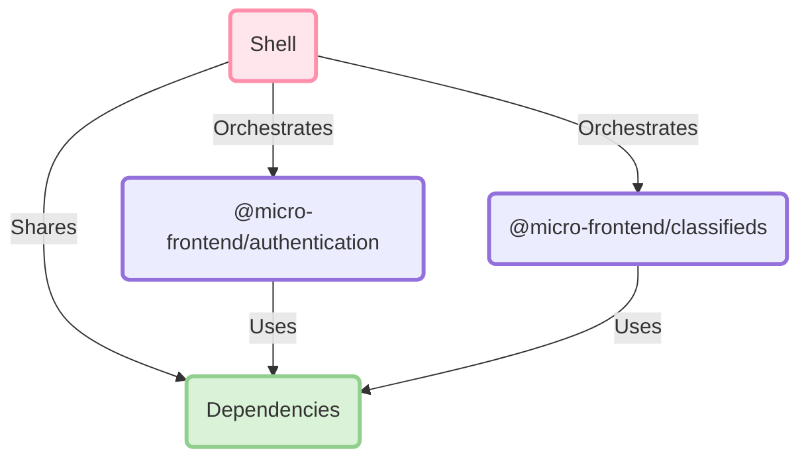

<br>
<div align="center">
    <h1>🧪 Micro frontends</h1>
    <em>Micro-frontend architecture can be defined as <strong>an architectural style</strong> where <strong>independently deliverable</strong> frontend applications are <strong>composed into a greater whole</strong></em>
    <p><a href="./docs"><strong>Explore the documentation »</strong></a></p>
</div>
<br>
<br>

## 🚀 Quickstart

**1️⃣ Install**

```shell
pnpm i
```

**2️⃣ Enjoy**

```shell
pnpm start
```

<br>

## 🏗️ Architecture

The example includes the following components:



<br>

## 📖 Documentation

The full documentation is available [here](./docs).

<br>
